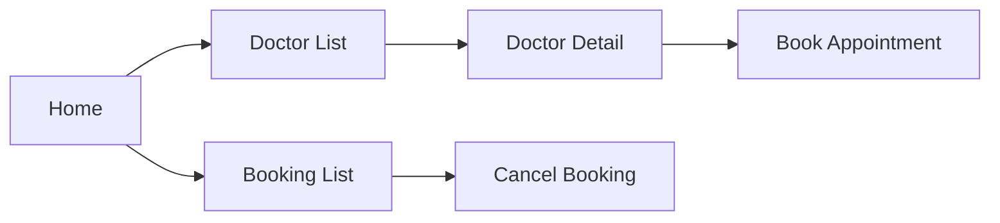
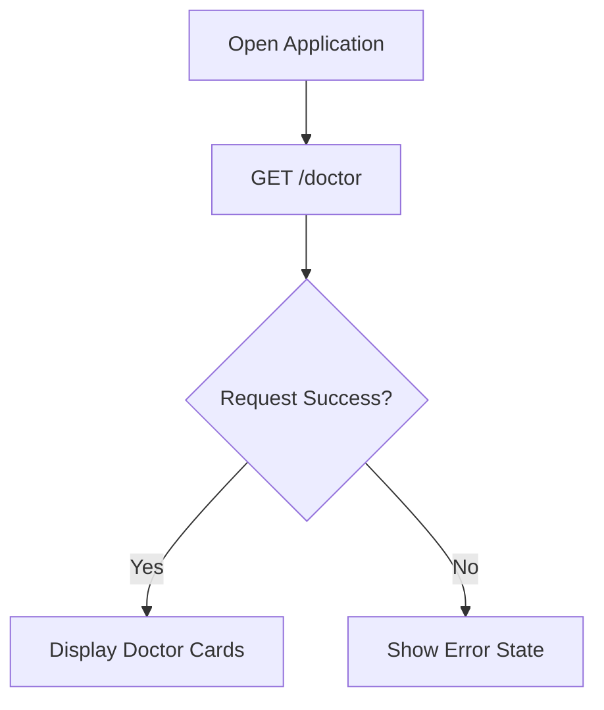
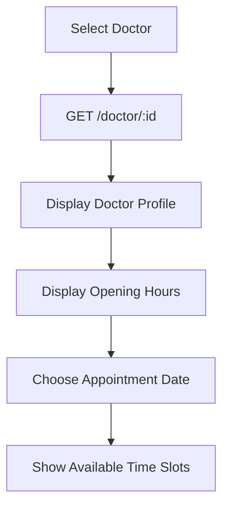
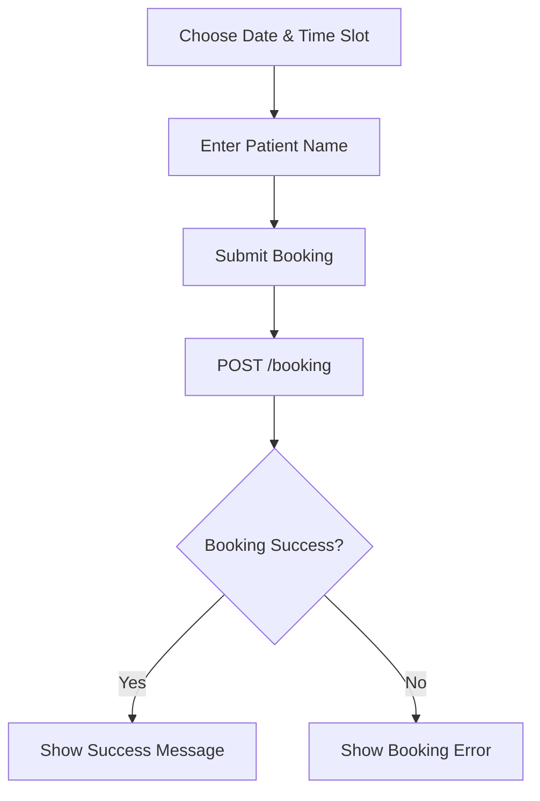
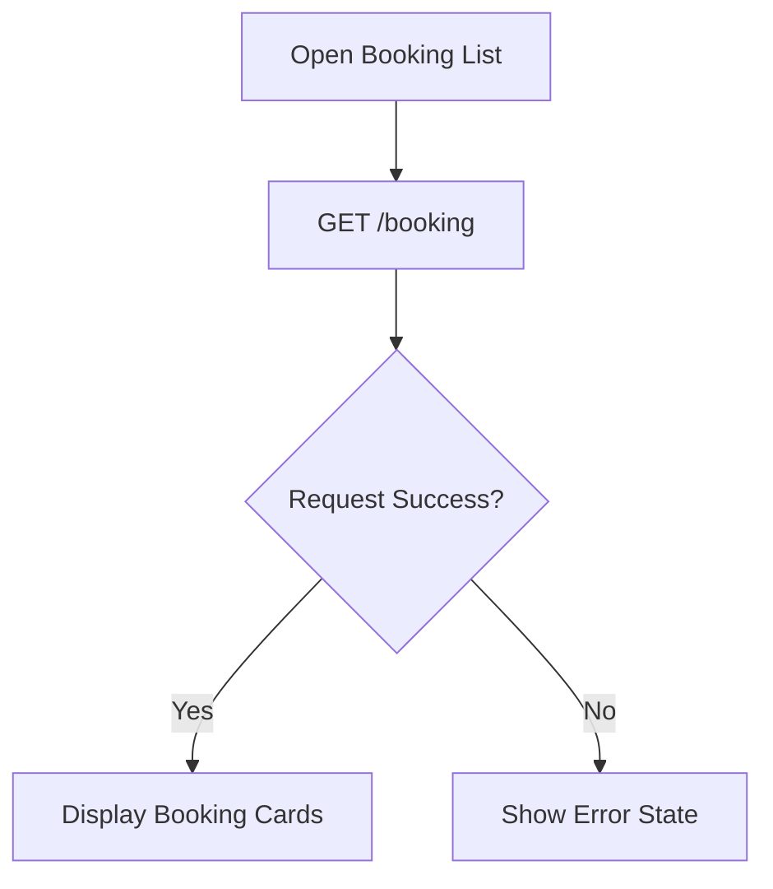
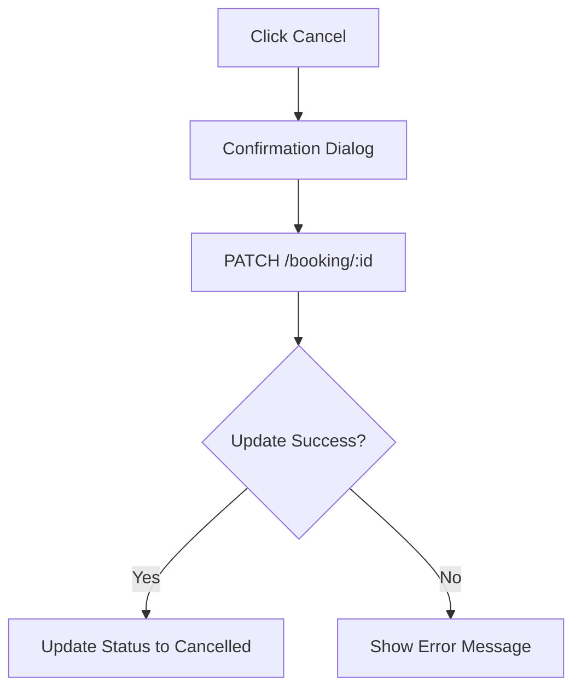

# Doctor Booking Application — System Analysis

## Project Objective

Build a responsive web application that allows patients to:

- Browse doctors.
- View doctor information and clinic opening hours.
- Book an appointment.
- View booking history.
- Cancel an existing booking.

The application communicates with the provided REST API.

---

# Features

| Feature | API |
|---------|-----|
| Doctor List | GET /doctor |
| Doctor Detail | GET /doctor/:id |
| Booking List | GET /booking |
| Create Booking | POST /booking |
| Cancel Booking | PATCH /booking/:id |

---

# User Flow Overview



---

# Flow 1 — Load Doctor List



Purpose

- Display all available doctors on the homepage.
- Each doctor card is selectable.

---

# Flow 2 — View Doctor Profile & Availability



Purpose

- Show doctor's description, address, and weekly opening hours.
- Time slots depend on the selected date and opening hours.

---

# Flow 3 — Create Booking



Booking Information

- Doctor ID
- Patient Name
- Booking Date
- Booking Start Time

Validation

- Date cannot be in the past.
- Doctor must be open on the selected day.
- Booking time must be within opening hours.

---

# Flow 4 — View Booking List



Each booking card displays:

- Doctor ID
- Patient Name
- Booking Date
- Booking Time
- Booking Status

---

# Flow 5 — Cancel Booking



Purpose

- Update booking status to `cancelled`.
- Keep cancelled bookings in history.

---

# API Usage

## GET /doctor

Used on homepage to retrieve all doctors.

## GET /doctor/:id

Used when a doctor is selected to retrieve detailed information and opening hours.

## GET /booking

Retrieve all bookings for booking history.

## POST /booking

Create a new booking.

Required request body:

```json
{
  "name": "John Smith",
  "doctorId": "M2163",
  "start": 10,
  "date": "2026-08-25"
}
```

## PATCH /booking/:id

Update booking status.

```json
{
  "status": "cancelled"
}
```

---

# Business Rules

| Rule | Description |
|------|-------------|
| Appointment Duration | Every booking lasts 1 hour. |
| Opening Hours | Users can only book within doctor's opening hours. |
| Closed Day | Booking is disabled if the doctor is closed. |
| Past Booking | Users cannot select dates or time slots in the past. |
| Cancel Booking | Booking status becomes `cancelled` instead of being deleted. |

---

# Assumptions

- Each booking belongs to one doctor.
- One booking occupies one one-hour time slot.
- Backend validates booking conflicts.
- Cancelled bookings remain visible in booking history.
- The application uses the user's local timezone.
- API authentication is provided through the supplied API key.

---

# Expected Screens

1. **Home Page**
   - Doctor list.
   - Responsive doctor cards.

2. **Doctor Detail**
   - Doctor information.
   - Opening hours.
   - Date picker.
   - Available time slots.
   - Booking form.

3. **Booking List**
   - List of existing bookings.
   - Booking status badge.
   - Cancel action.